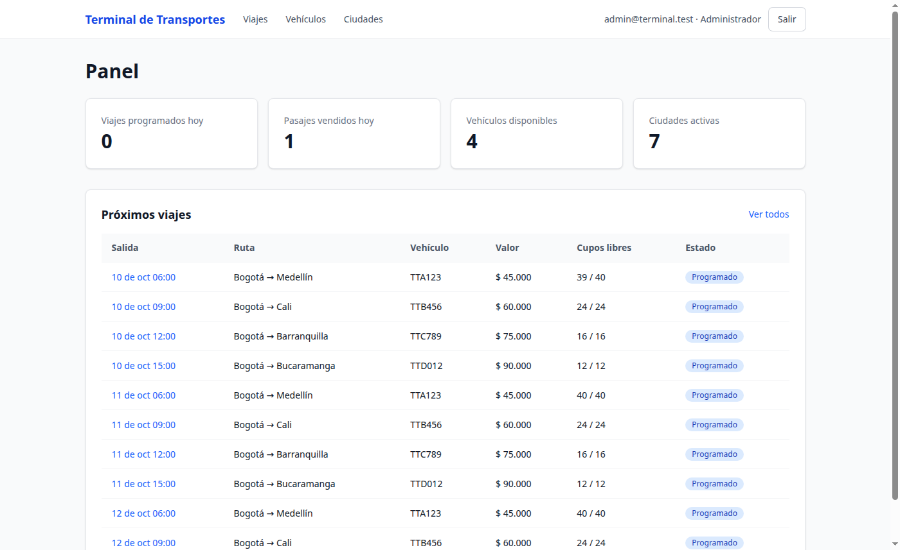
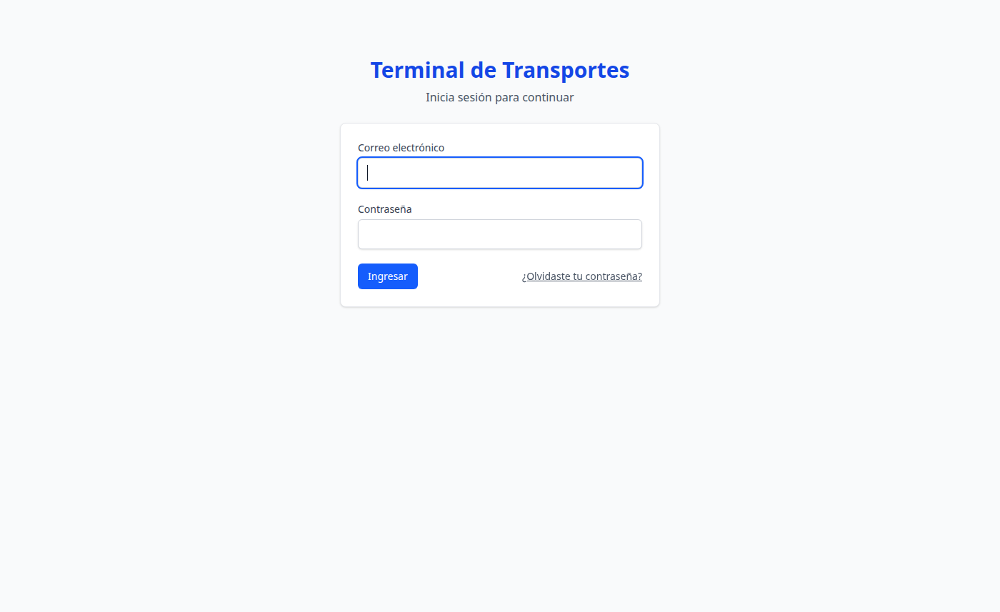
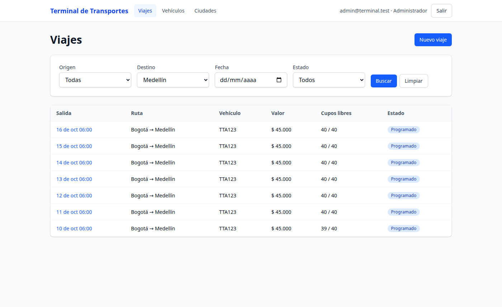
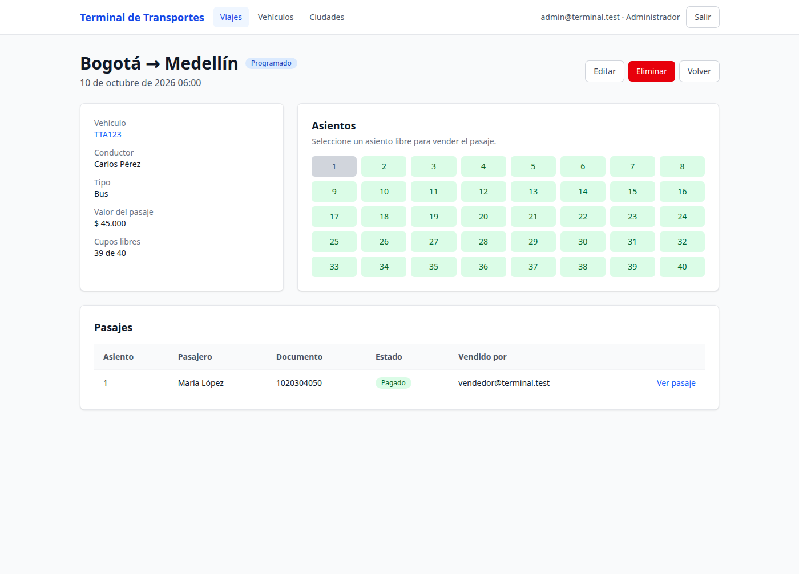
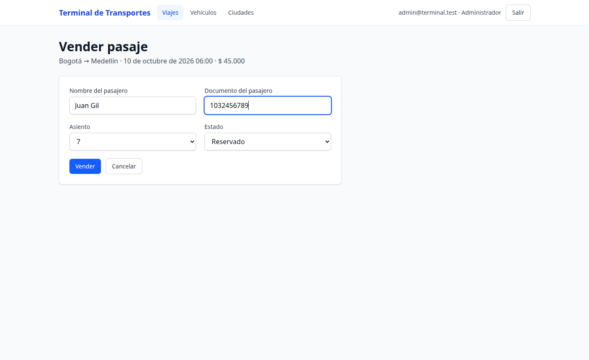
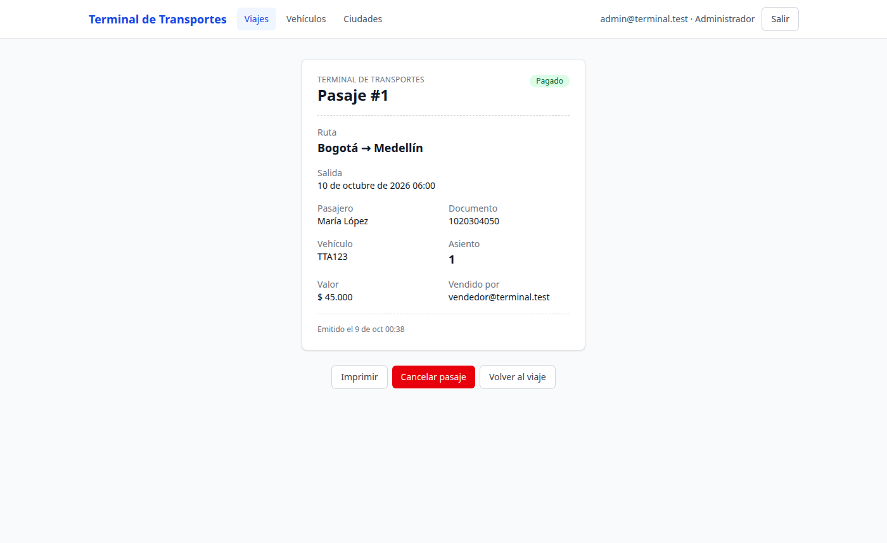
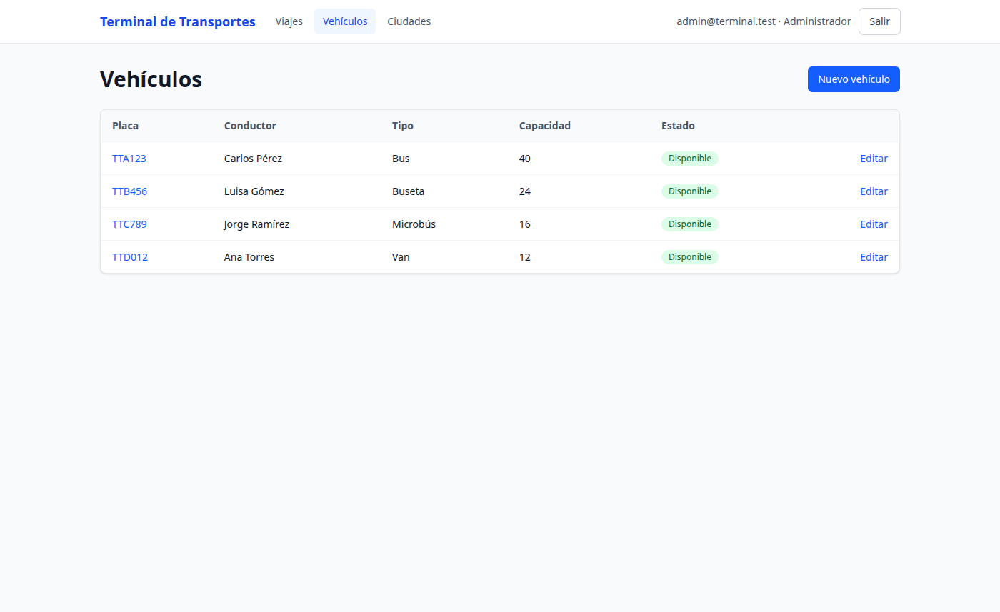

# Terminal de Transportes

Aplicación web para administrar una terminal de transporte intermunicipal: ciudades, vehículos y viajes, y venta de pasajes en taquilla con selección de asiento y tiquete imprimible.



## Funcionalidades

- **Panel** con indicadores del día (viajes programados, pasajes vendidos, vehículos disponibles, ciudades activas) y los próximos viajes.
- **Ciudades**: alta, edición y estado activo/inactivo. No se pueden eliminar si tienen viajes asociados.
- **Vehículos**: placa normalizada y única, tipo (bus, buseta, microbús, van), capacidad, conductor y estado (disponible, mantenimiento, inactivo).
- **Viajes**: origen, destino, salida, vehículo y valor del pasaje. Se pueden filtrar por origen, destino, fecha y estado, con paginación.
- **Venta de pasajes**: un mapa de asientos muestra cuáles están libres. Valida que el asiento no esté ocupado y que esté dentro de la capacidad del vehículo. Los pasajes se pueden marcar como pagados o cancelar.
- **Tiquete** listo para imprimir.
- **Autenticación y roles**: el administrador gestiona todo el catálogo; el vendedor consulta viajes y vende pasajes.
- Interfaz en español, con zona horaria de Bogotá y valores en pesos.

## Capturas

| Inicio de sesión | Viajes con filtros |
| --- | --- |
|  |  |

| Mapa de asientos | Venta de pasaje |
| --- | --- |
|  |  |

| Tiquete | Vehículos |
| --- | --- |
|  |  |

## Tecnologías

- Ruby 3.4 y Rails 8.1
- SQLite con Solid Queue, Solid Cache y Solid Cable
- Hotwire (Turbo y Stimulus) con importmap
- Tailwind CSS 4
- Pagy para la paginación y rails-i18n para la traducción
- Minitest y Capybara/Selenium para las pruebas; RuboCop y Brakeman para la calidad
- Docker (devcontainer) y Kamal con Thruster para el despliegue

## Desarrollo

Abrir la carpeta en VS Code y elegir **Reopen in Container** (requiere Docker). El devcontainer ejecuta `bin/setup`.

```sh
bin/rails db:seed   # usuarios admin@terminal.test y vendedor@terminal.test, clave "password"
bin/dev             # http://localhost:3000
```

Roles: el **administrador** gestiona ciudades, vehículos y viajes; el **vendedor** consulta viajes y vende pasajes.

## Pruebas y calidad

```sh
bin/rails test && bin/rails test:system
bin/rubocop
bin/brakeman
```

## Despliegue (Kamal)

Definir `KAMAL_REGISTRY_USERNAME`, `KAMAL_REGISTRY_PASSWORD`, `KAMAL_SERVER_IP`, `KAMAL_APP_HOST` y `SEED_PASSWORD`, y luego:

```sh
bin/kamal setup
bin/kamal seed
```

La versión Rails 5.1 original está en la etiqueta `legacy-rails5`.
